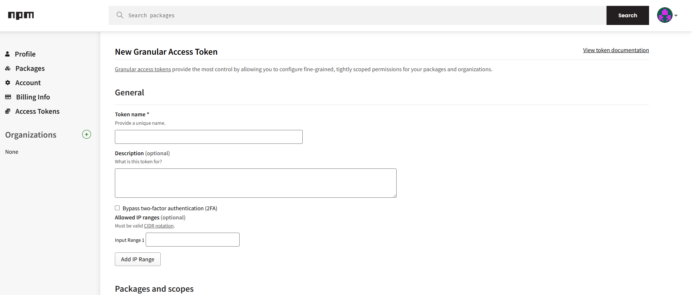
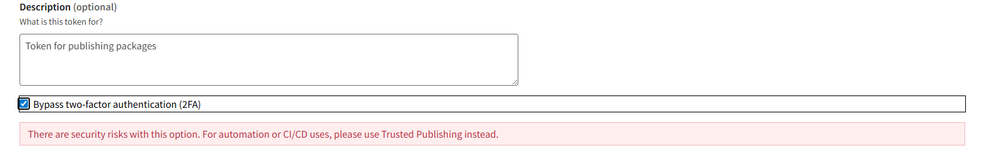

# Building and Publishing Toto MS package on NPM

To build and publish a new version on NPM follow this guide. 

## Building the package
To **build** the package, run: 
```
npm run build
```

## Upload on NPM
Before uploading, you need an Access Token. <br>
To do that, you need to get a new Token from your NPM account settings: 



It is very important, if you want to publish from a laptop, to **Bypass two-factor authentication (2FA)** for this token. 



In permissions, add *Read and Write* to selected packages.

Once you have the token setup, you can **upload** the package to NPM, run:
```
npm config set //registry.npmjs.org/:_authToken YOUR_TOKEN
npm publish
```
